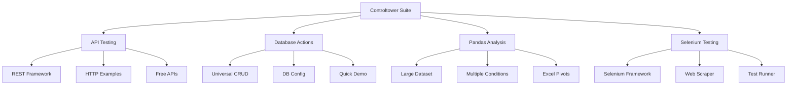

# 🏗️ Controltower - Enterprise Automation Suite
## 🚀 API Testing • 🗄️ Database Operations • 📊 Data Analysis • 🕷️ Web Automation

**Controltower** is a comprehensive enterprise-grade automation platform built with Python, designed for professional software testing, data analysis, and business automation workflows. Each module follows industry best practices with comprehensive logging, error handling, type hints, and professional documentation.

## 🎯 Architecture Overview



## 📦 Module Overview

| Module | Purpose | Key Features | Use Cases |
|--------|---------|--------------|-----------|
| **🚀 API Testing** | REST API automation & testing | All HTTP methods, error injection, comprehensive logging | API validation, integration testing, service monitoring |
| **🗄️ Database Actions** | Universal database CRUD operations | Multi-DB support, Pandas integration, free cloud configs | Data migration, ETL processes, database testing |
| **📊 Pandas Analysis** | Large dataset analysis & Excel automation | 10 lakh+ rows, advanced filtering, automated pivot tables | Business intelligence, data analysis, reporting |
| **🕷️ Selenium Testing** | Cross-browser web automation | Multi-browser support, Page Object Model, screenshot capture | Web testing, data extraction, UI automation |

## 🚀 Quick Start

### 1. Installation
```bash
# Clone the repository
git clone <your-repo-url>
cd Controltower

# Install dependencies
pip install -r requirements.txt

# For Excel functionality (Windows only)
pip install pywin32
```

### 2. Choose Your Module
```bash
# API Testing
cd API_Testing
python REST_API_Testing.py

# Database Operations  
cd database_actions
python quick_start.py

# Data Analysis
cd pandas_analysis
python main_runner.py

# Web Automation
cd "selenium Testing"
python quick_demo.py
```

## 📁 Project Structure

```
Controltower/
├── README.md                          # 📖 This overview
├── requirements.txt                   # 📦 Main dependencies
│
├── API_Testing/                       # 🚀 REST API Testing Suite
│   ├── README.md                      # 📖 API testing documentation
│   ├── REST_API_Testing.py            # 🎯 Main API framework
│   ├── Free_API_Examples.py           # 🌐 Public API examples
│   ├── HTTP_API_Examples.py           # 🔐 HTTP examples
│   └── logs/                          # 📝 API test logs
│
├── database_actions/                  # 🗄️ Universal Database Framework
│   ├── README.md                      # 📖 Database documentation
│   ├── universal_crud_framework.py    # 🎯 Main CRUD framework
│   ├── opensource_db_config.py        # ⚙️ Database configurations
│   ├── run_opensource_demo.py         # 🚀 SQLite demo (no server)
│   ├── opensource_crud_examples.py    # 📋 CRUD examples
│   ├── quick_start.py                 # 🎯 Interactive setup
│   └── logs/                          # 📝 Database logs
│
├── pandas_analysis/                   # 📊 Data Analysis Suite
│   ├── README.md                      # 📖 Data analysis documentation
│   ├── main_runner.py                 # 🎯 Main menu application
│   ├── large_dataset_generator.py     # 🚀 10 lakh+ row generation
│   ├── multiple_conditions_examples.py# 🎯 Advanced filtering
│   ├── excel_pivot_creator.py         # 📊 Excel automation
│   ├── guaranteed_pivot_excel.py      # ✅ Simple pivot creation
│   └── simple_excel_creator.py        # 📄 Basic Excel operations
│
└── selenium Testing/                  # 🕷️ Web Automation Suite
    ├── README.md                      # 📖 Selenium documentation
    ├── selenium_framework.py          # 🎯 Main automation framework
    ├── config.py                      # ⚙️ Testing configuration
    ├── main_test_runner.py            # 🚀 Test orchestrator
    ├── web_scraper.py                 # 🕷️ Data extraction
    ├── advanced_data_extractor.py     # 🔍 Advanced scraping
    ├── quick_demo.py                  # 🎯 Quick start demo
    ├── requirements.txt               # 📦 Selenium dependencies
    ├── logs/                          # 📝 Test logs
    ├── screenshots/                   # 📸 Test screenshots
    └── extraction_results/            # 📊 Scraping results
```

## ⭐ Key Features

### 🔧 Professional Engineering Standards
- ✅ **Type Hints**: Full type annotations throughout all modules
- ✅ **Comprehensive Logging**: File + console handlers with timestamps and emoji output  
- ✅ **Error Handling**: Try-catch blocks with graceful fallbacks and detailed traceback logging
- ✅ **Documentation**: Google-style docstrings with Args, Returns, and Raises sections
- ✅ **Configuration**: Dataclass-based configs with environment variable support
- ✅ **Progress Tracking**: Real-time progress indicators with timing and memory info

### 🚀 Production-Ready Features
- ✅ **Retry Logic**: Configurable retry mechanisms for network operations
- ✅ **Resource Management**: Automatic cleanup and connection pooling
- ✅ **Performance Monitoring**: Memory tracking and operation timing
- ✅ **Cross-Platform**: Works on Windows, macOS, and Linux (with platform-specific optimizations)
- ✅ **Modular Design**: Independent modules that can be used separately or together
- ✅ **Enterprise Integration**: Easy integration with CI/CD pipelines and enterprise systems

### 🎯 Business-Ready Solutions
- ✅ **Scalability**: Handles large datasets (1M+ rows) and high-volume operations
- ✅ **Reliability**: Robust error handling and graceful degradation
- ✅ **Maintainability**: Clean architecture with separation of concerns
- ✅ **Extensibility**: Plugin architecture for custom extensions
- ✅ **Documentation**: Comprehensive README files and inline documentation

## 🛠️ Technology Stack

| Category | Technologies |
|----------|-------------|
| **Core Language** | Python 3.8+ with full type hints |
| **Data Processing** | Pandas 2.1+, NumPy 1.24+ |
| **Database** | SQLAlchemy 2.0+, PyODBC, PostgreSQL, MySQL, SQLite |
| **Web Testing** | Selenium 4.15+, Requests 2.31+ |
| **Office Integration** | PyWin32 (Excel automation on Windows) |
| **Testing** | Pytest 7.4+, pytest-html 3.2+ |
| **Logging** | Python logging with custom formatters |
| **Configuration** | Dataclasses, environment variables, YAML/JSON |

## 🎯 Use Cases by Industry

### 🏢 Enterprise Software Testing
- **API Integration Testing**: Validate REST APIs across microservices
- **Database Migration**: ETL processes and data validation  
- **Web Application Testing**: Cross-browser automated testing
- **Performance Analysis**: Large dataset processing and reporting

### 📊 Business Intelligence & Analytics  
- **Data Processing**: Handle millions of rows with advanced filtering
- **Excel Automation**: Generate professional pivot tables and dashboards
- **Database Analytics**: CRUD operations across multiple database types
- **Reporting Automation**: Automated report generation and distribution

### 🔍 Quality Assurance & Testing
- **API Validation**: Comprehensive REST API testing with error scenarios
- **Web Scraping**: Extract data from multiple websites and sources
- **Cross-Browser Testing**: Validate applications across different browsers
- **Database Testing**: Validate data integrity and CRUD operations

### 🚀 DevOps & Automation
- **CI/CD Integration**: Automated testing pipelines
- **Data Migration**: Database-to-database transfers and validations
- **Monitoring**: API health checks and performance monitoring
- **Infrastructure Testing**: Validate database connections and configurations

## 🚀 Getting Started Guide

### 1. **API Testing** - Start Here for REST API Automation
```bash
cd API_Testing
python REST_API_Testing.py
# Test against JSONPlaceholder, HTTPBin, and other public APIs
```

### 2. **Database Operations** - Perfect for Data Engineers
```bash  
cd database_actions
python run_opensource_demo.py
# No server setup required - uses SQLite for instant demo
```

### 3. **Data Analysis** - Ideal for Business Analysts
```bash
cd pandas_analysis  
python main_runner.py
# Generate 10 lakh rows and create Excel pivot tables
```

### 4. **Web Automation** - Great for QA Engineers
```bash
cd "selenium Testing"
python quick_demo.py  
# Multi-browser testing with screenshot capture
```

## 📈 Performance Benchmarks

| Operation | Dataset Size | Typical Time | Memory Usage |
|-----------|-------------|--------------|--------------|
| **Data Generation** | 1M rows × 100 cols | 30-60 seconds | 2-4 GB |
| **API Testing** | 100 requests | 30-60 seconds | <100 MB |
| **Database CRUD** | 10K records | 5-15 seconds | 200-500 MB |
| **Web Scraping** | 50 pages | 2-5 minutes | 200-400 MB |
| **Excel Pivot Generation** | 50K rows | 30-90 seconds | 500 MB-1 GB |

## 🤝 Contributing

We welcome contributions! Each module has its own detailed README with specific contribution guidelines:

- 🚀 [API Testing Guidelines](API_Testing/README.md)
- 🗄️ [Database Actions Guidelines](database_actions/README.md)  
- 📊 [Pandas Analysis Guidelines](pandas_analysis/README.md)
- 🕷️ [Selenium Testing Guidelines](selenium%20Testing/README.md)

## 📄 License

This project is licensed under the MIT License - see the LICENSE file for details.

## 🆘 Support

### 📚 Documentation
Each module contains comprehensive documentation and examples:
- Detailed README files with usage examples
- Inline code documentation with Google-style docstrings
- Configuration examples and troubleshooting guides

### 🐛 Issue Reporting
Please use GitHub Issues for bug reports and feature requests:
- Include module name, Python version, and error messages
- Provide minimal reproducible examples
- Check existing issues before creating new ones

### 💡 Feature Requests  
We're actively developing new features:
- Real-time monitoring dashboards
- Advanced AI/ML integrations  
- Cloud deployment templates
- Enterprise security enhancements

---

**Built with ❤️ for enterprise automation and testing professionals**

*Controltower - Where automation meets reliability* 🏗️
